# Sistema Modular de Configuración y Gestión de Usuarios

Proyecto integrador de Python que aplica entornos virtuales, módulos,
paquetes, variables de entorno y manejo de excepciones.

---

## Requisitos previos

- Python 3.10 o superior
- Git Bash (en Windows)

---

## Instalación paso a paso

### 1. Clonar el repositorio
```bash
git clone https://github.com/tu-usuario/sistema_usuarios.git
cd sistema_usuarios
```

### 2. Crear y activar el entorno virtual
```bash
python -m venv venv
source venv/Scripts/activate    # Git Bash en Windows
```

### 3. Instalar dependencias
```bash
pip install -r requirements.txt
```

### 4. Configurar variables de entorno
```bash
cp .env.example .env
# Edita .env con tus valores reales
```

### 5. Ejecutar el proyecto
```bash
python main.py
```

---
```bash

## Estructura del proyecto
SISTEMA_USUARIOS/
│
├── app/                        ← Paquete principal
│   ├── init.py
│   │
│   ├── config/                 ← Subpaquete de configuración
│   │   ├── init.py
│   │   └── settings.py         ← Carga variables de entorno con dotenv
│   │
│   └── usuarios/               ← Subpaquete de lógica de negocio
│       ├── init.py
│       ├── gestor.py           ← CRUD de usuarios
│       └── validaciones.py     ← Validaciones y manejo de excepciones
│
├── images/                     ← Capturas de pantalla del proyecto
│
├── venv/                       ← Entorno virtual (no se sube a GitHub)
│
├── .env                        ← Variables de entorno (no se sube a GitHub)
├── .env.example                ← Plantilla pública de variables
├── .gitignore                  ← Archivos ignorados por Git
├── main.py                     ← Punto de entrada / menú de consola
├── README.md                   ← Documentación del proyecto
└── requirements.txt            ← Dependencias del proyecto
```

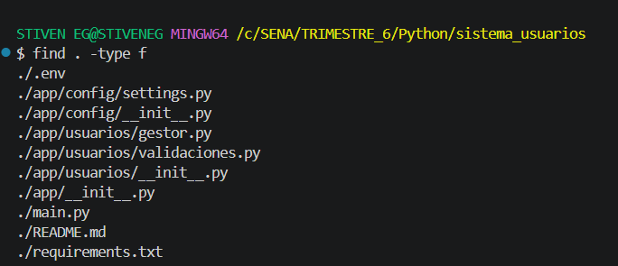

---

# Funcionalidades

## Registrar Usuarios
El sistema valida cada campo antes de registrar.

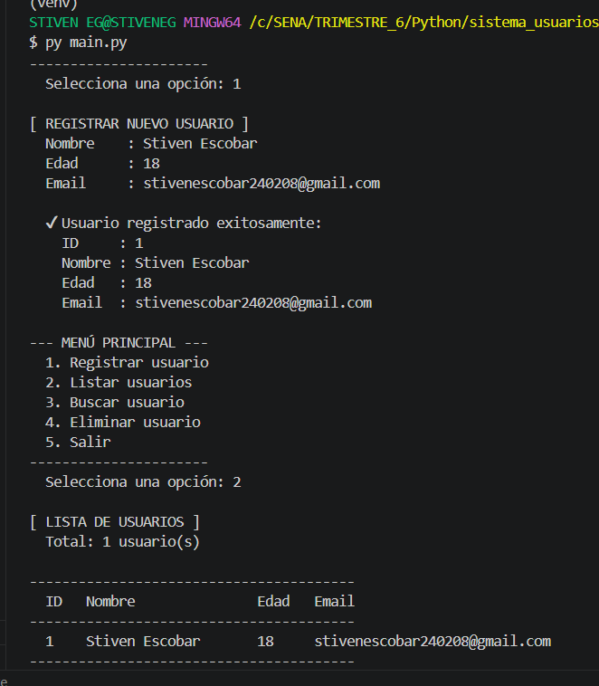
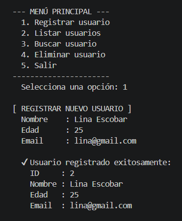

**Validaciones activas:**

- Nombre incorrecto:
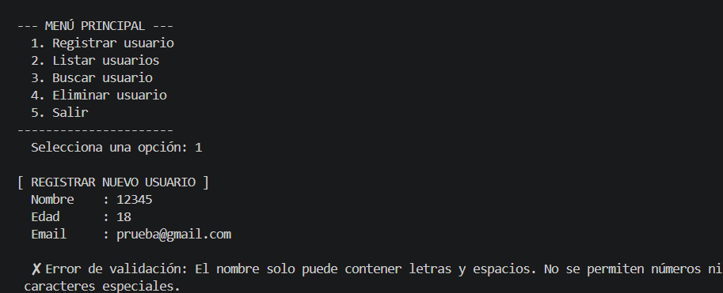

- Edad incorrecta:
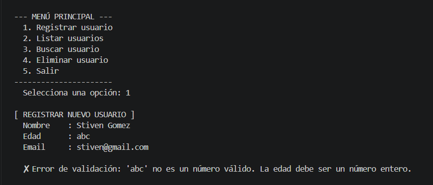

- Correo incorrecto:
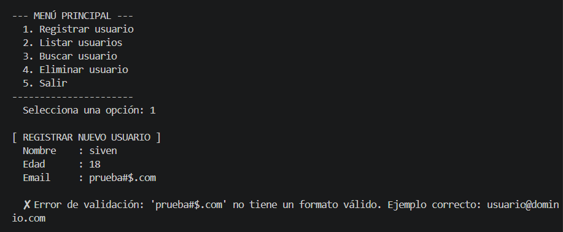

- Registro vacío:
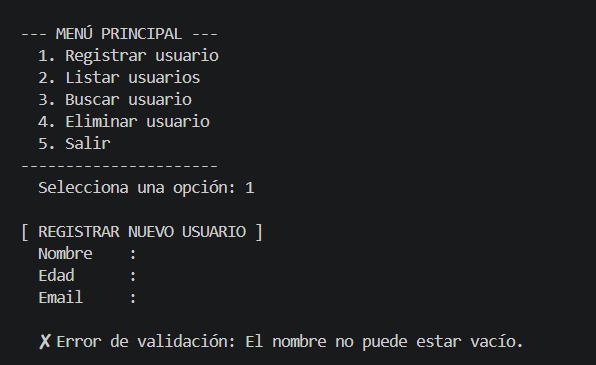

---

### Listar Usuarios
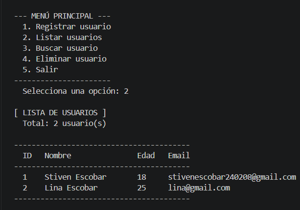

---

### Buscar Usuarios
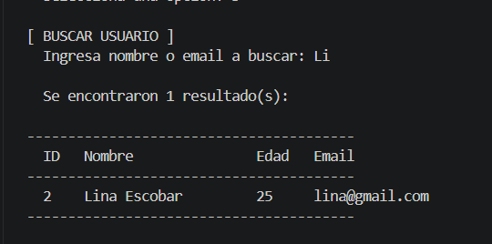
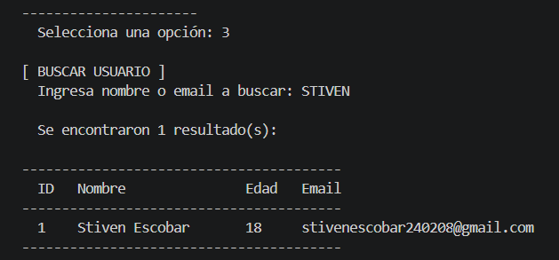
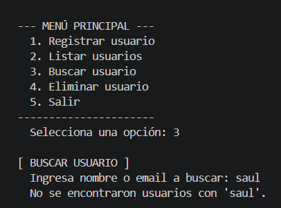

---

### Eliminar Usuarios
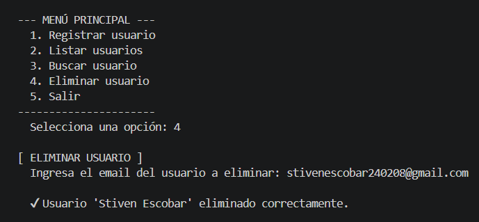
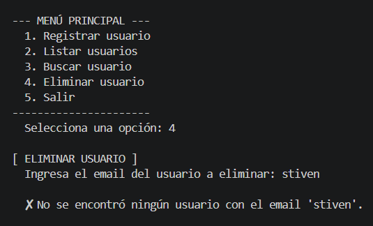
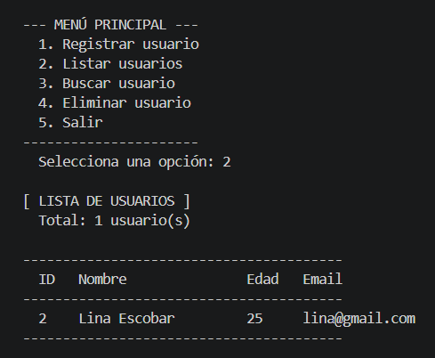


---

### Salida del sistema
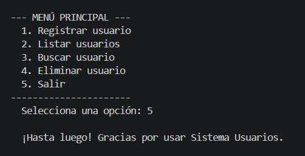
---

## Módulos y paquetes — explicación

| Archivo | Responsabilidad |
|---|---|
| `app/config/settings.py` | Carga `.env` con `python-dotenv` y expone constantes |
| `app/usuarios/validaciones.py` | Valida nombre, edad y email; define excepciones propias |
| `app/usuarios/gestor.py` | Clase `GestorUsuarios` con registrar, listar, buscar, eliminar |
| `main.py` | Interfaz de consola; orquesta todas las capas |

---

## Variables de entorno

| Variable | Descripción | Ejemplo |
|---|---|---|
| `APP_NAME` | Nombre mostrado en el encabezado | `Sistema Usuarios` |
| `APP_VERSION` | Versión de la aplicación | `1.0` |
| `ADMIN_USER` | Usuario administrador | `admin_admin` |
| `ADMIN_EMAIL` | Email del administrador | `admin@sistema.com` |
| `MAX_USERS` | Límite máximo de usuarios | `100` |

---

## Dependencias

Ver `requirements.txt`. Principal dependencia: `python-dotenv`.

---
## VIDEO EXPLICACIÓN
 [Youtube]()

## Autor

Stiven Escobar Gomez — [GitHub](https://github.com/stivenescobarg/sistema_usuarios.git)